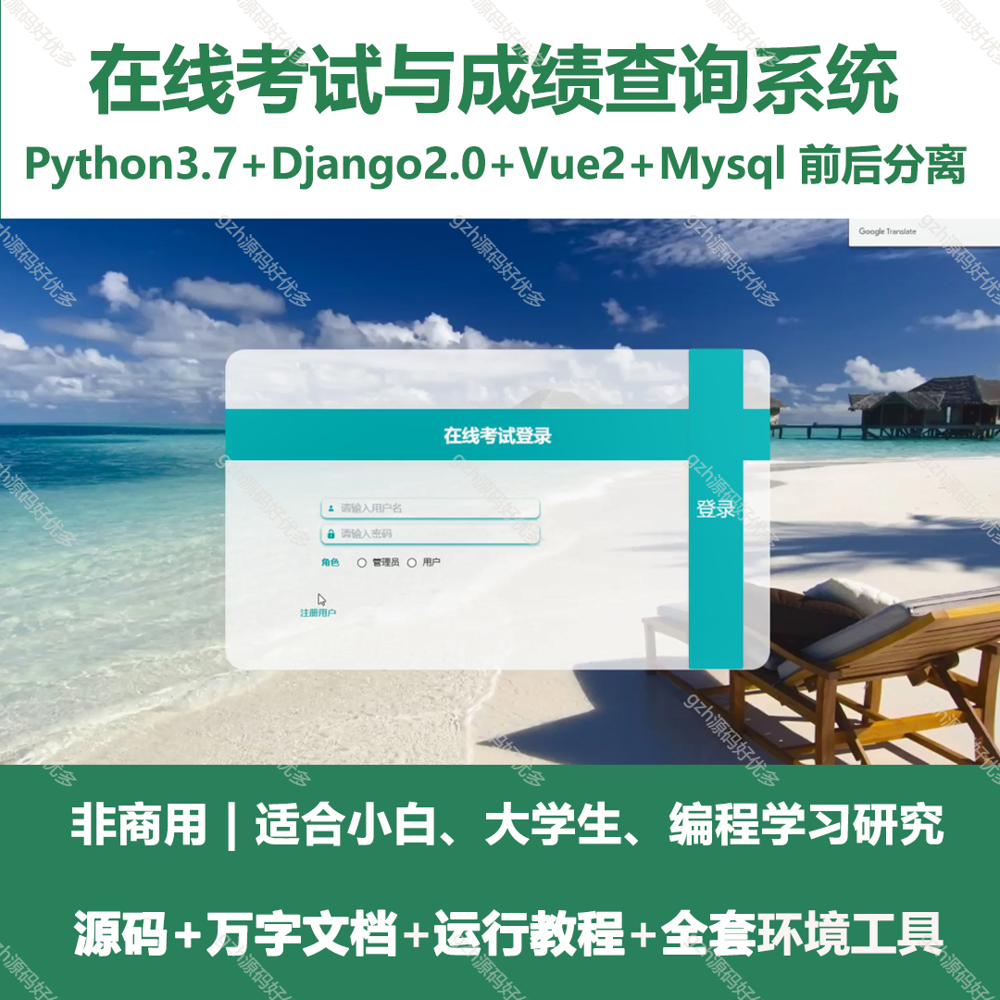
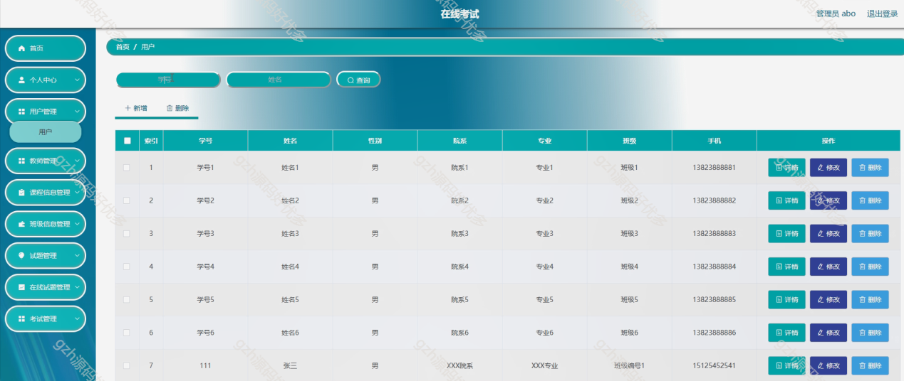
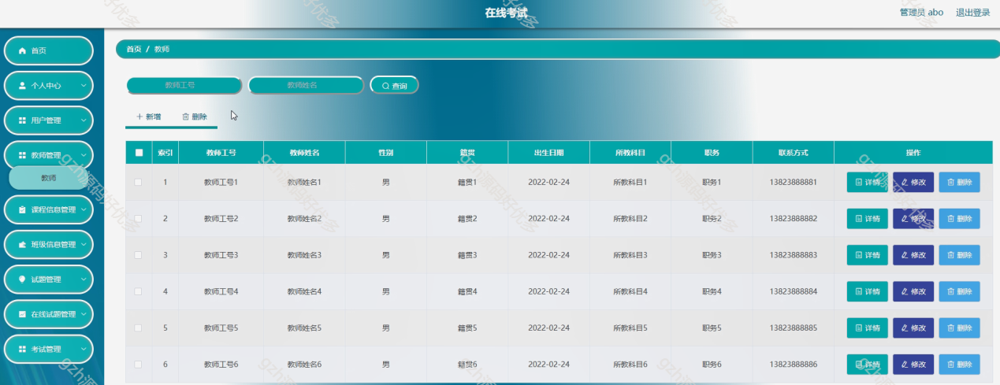
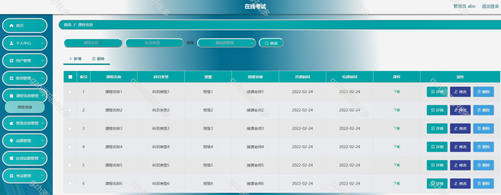
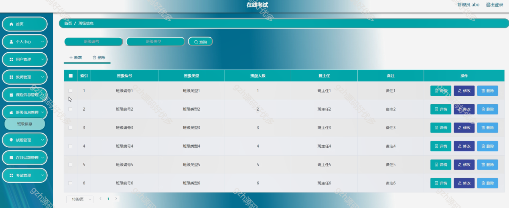
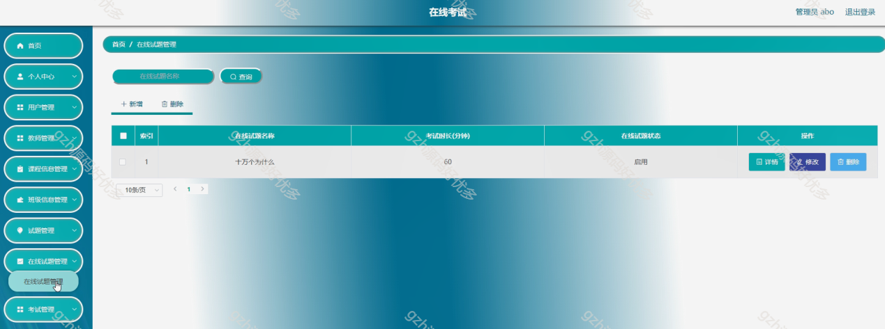
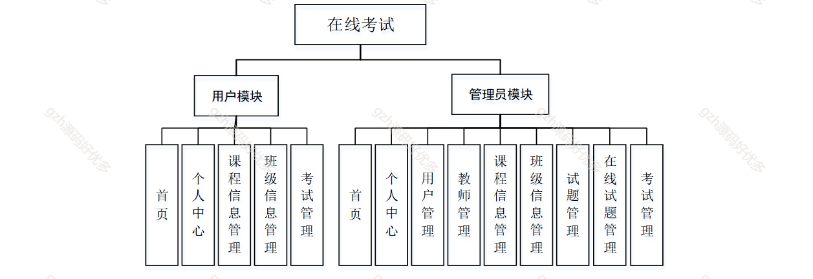
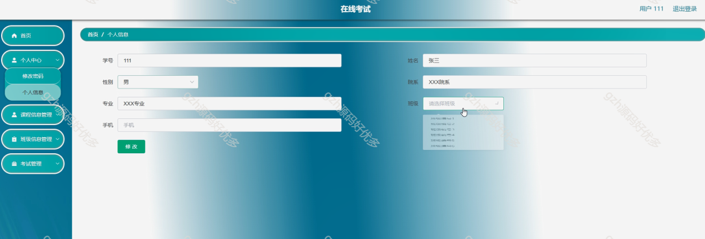

# python021
python021基于Python的在线考试与成绩查询系统
 
## 查看主页获取源码

### 一、关键词
考试系统，在线考试管理系统

 

### 二、作品包含

源码+数据库+万字文档+全套环境和工具资源+部署教程

 

### 三、项目技术

前端技术：Html、Css、Js、Vue2、Element-ui
后端技术：Python3.7、Django2.0

  

 

### 四、运行环境（以下版本亲测，其他版本未知，请自测）

开发工具：PyCharm + VSCODE

数据库：MySQL5.7

数据库管理工具：Navicat10+

Python：Python3.7

前端Nodejs：14

浏览器：谷歌浏览器

 

### 五、项目介绍

项目编号：python021

在线考试系统是一种使用网络和计算机技术进行考试的应用软件。其主要功能包括创建试题库，组织和发放在线考试，自动批改客观题并生成分数报告等。这种系统的优点在于能够提高考试的效率和公正性，减少人为的干扰和错误。同时，因为试题和答案都存储在数据库中，使得试题的管理和保密性得到了很好的保障。

在线考试系统包含用户模块（首页、个人中心、课程 / 班级信息及考试管理 ）与管理员模块（首页、个人中心、用户 / 教师 / 课程 / 班级信息及试题、在线试题、考试管理 ），实现考试全流程线上化管控 。

 

### 六、运行截图

